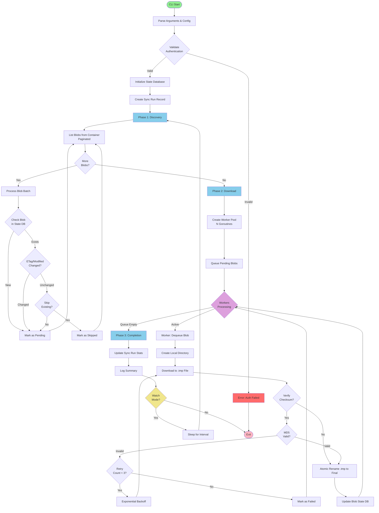

# getblobz - Azure Blob Storage Sync CLI Tool - Developer Notes

## Overview

A Go-based CLI application that reliably synchronises files from an Azure Blob Storage container to a local filesystem. The tool is designed to handle large numbers of small files efficiently, support incremental syncing, and provide robust error handling for continuous operation.

## Business Requirements

### Primary Use Cases
1. **Initial Bulk Sync**: Download all existing files from an Azure container to local storage
2. **Incremental Sync**: Continuously monitor and download only new files added to the container
3. **Resumable Operations**: Handle interruptions gracefully and resume from last known state
4. **Configuration Flexibility**: Support multiple authentication methods and configurable parameters

### Platform Requirements
The tool must run efficiently on diverse hardware platforms:
- **High-Performance Servers**: Utilise full CPU/memory/network capacity
- **Resource-Constrained Devices**: Raspberry Pi, low-power servers, edge devices
- **Adaptive Performance**: Automatically adjust to available system resources

## Technical Architecture

### Technology Stack
- **Language**: Go 1.21+
- **Azure SDK**: `github.com/Azure/azure-sdk-for-go/sdk/storage/azblob` (v1.x)
- **CLI Framework**: `github.com/spf13/cobra` for command structure
- **Configuration**: `github.com/spf13/viper` for config file and env var support
- **State Management**: SQLite database via `github.com/mattn/go-sqlite3` for tracking sync state

### Core Components

```
getblobz/
├── cmd/
│   ├── root.go           # Root command and global flags
│   ├── sync.go           # Sync command implementation
│   ├── init.go           # Initialise configuration
│   └── status.go         # Show sync status and statistics
├── internal/
│   ├── azure/
│   │   ├── client.go     # Azure Blob Storage client wrapper
│   │   └── auth.go       # Authentication handlers
│   ├── sync/
│   │   ├── syncer.go     # Core sync logic
│   │   ├── worker.go     # Concurrent download workers
│   │   └── state.go      # State management and tracking
│   ├── storage/
│   │   ├── db.go         # SQLite database operations
│   │   └── models.go     # Data models
│   └── config/
│       └── config.go     # Configuration management
├── pkg/
│   └── logger/
│       └── logger.go     # Structured logging
├── main.go
├── go.mod
└── go.sum
```

## Application Logic Flow



## Functional Specifications

### 1. Authentication Methods

Support multiple authentication strategies:

#### Connection String
```bash
getblobz sync --connection-string "DefaultEndpointsProtocol=https;..."
```

#### Account Key
```bash
getblobz sync --account-name myaccount --account-key "key=="
```

#### Managed Identity (Azure VM/Container)
```bash
getblobz sync --account-name myaccount --use-managed-identity
```

#### Service Principal
```bash
getblobz sync --account-name myaccount \
  --tenant-id "xxx" \
  --client-id "yyy" \
  --client-secret "zzz"
```

#### Azure CLI Credentials (fallback)
```bash
getblobz sync --account-name myaccount --use-azure-cli
```

### 2. Command Structure

#### `sync` Command
Primary command for synchronising blobs.

**Flags:**
```
--container string         Container name (required)
--output-path string       Local destination path (default: ./data)
--connection-string string Azure Storage connection string
--account-name string      Storage account name
--account-key string       Storage account key
--use-managed-identity     Use Azure Managed Identity
--tenant-id string         Azure AD tenant ID (for service principal)
--client-id string         Azure AD client ID (for service principal)
--client-secret string     Azure AD client secret (for service principal)
--use-azure-cli            Use Azure CLI credentials
--prefix string            Only sync blobs with this prefix
--workers int              Number of concurrent download workers (default: 10)
--batch-size int           Number of blobs to list per batch (default: 5000)
--watch                    Continuously watch for new files
--watch-interval duration  Interval between checks in watch mode (default: 5m)
--state-db string          Path to state database (default: ./.sync-state.db)
--force-resync             Ignore state and re-download all files
--skip-existing            Skip files that already exist locally
--verify-checksums         Verify MD5 checksums after download
--log-level string         Log level: debug, info, warn, error (default: info)
--log-format string        Log format: text, json (default: text)
--max-memory-mb int        Maximum memory usage in MB (default: auto-detect)
--max-cpu-percent int      Maximum CPU utilization percentage (default: 80)
--auto-throttle            Enable automatic throttling based on system load
--throttle-threshold float CPU load threshold for throttling (default: 0.8)
--bandwidth-limit string   Bandwidth limit (e.g., "10M", "100K") per second
--disk-buffer-mb int       Disk write buffer size in MB (default: 32)
```

**Examples:**
```bash
# Initial sync
getblobz sync \
  --container mycontainer \
  --connection-string "..." \
  --output-path ./downloads

# Watch mode for continuous sync
getblobz sync \
  --container mycontainer \
  --connection-string "..." \
  --watch \
  --watch-interval 2m

# Sync with prefix filter
getblobz sync \
  --container mycontainer \
  --connection-string "..." \
  --prefix "data/2024/"
```

#### `init` Command
Generate a configuration file template.

```bash
getblobz init --config ./config.yaml
```

#### `status` Command
Display sync statistics and current state.

```bash
getblobz status --state-db ./.sync-state.db
```

#### `dashboard` Command
Launch interactive TUI dashboard showing real-time sync status, statistics, and system metrics.

**Flags:**
```
--state-db string          Path to state database (default: ./.sync-state.db)
--refresh-interval int     Dashboard refresh interval in seconds (default: 2)
--theme string            Dashboard colour theme: default, dark, light (default: default)
```

**Features:**
- Real-time sync progress with visual progress bars
- File download rate (files/sec, MB/sec)
- System resource utilisation (CPU, Memory, Network, Disk I/O)
- Recent activity log (last 100 events)
- Historical sync statistics with sparkline graphs
- Error summary and failed files list
- Interactive navigation with keyboard shortcuts

**Example:**
```bash
# Launch dashboard
getblobz dashboard

# Custom refresh rate
getblobz dashboard --refresh-interval 1
```

**Dashboard Layout:**
```
┌─────────────────────────────────────────────────────────────────────────────┐
│ getblobz - Azure Blob Sync Dashboard                    [Q]uit [R]efresh   │
├─────────────────────────────────────────────────────────────────────────────┤
│ Current Sync Status                                                         │
│ Container: mycontainer                    Status: ████████░░ Running (82%)  │
│ Files: 8,234 / 10,000                    Speed: 156 files/s | 234 MB/s     │
│ Duration: 2m 45s                         ETA: 45s                           │
│                                                                              │
│ Progress: [████████████████████████████████████░░░░░░░░] 82%               │
├─────────────────────────────────────────────────────────────────────────────┤
│ System Resources                         Throttling: ● Active (CPU > 80%)  │
│ CPU:    [████████████████░░░░░░░░] 82%   Workers: 8 → 5 (throttled)      │
│ Memory: [████████░░░░░░░░░░░░░░░░] 45%   Bandwidth: 234/500 MB/s          │
│ Disk:   [██████░░░░░░░░░░░░░░░░░░] 38%   I/O Wait: 12%                    │
├─────────────────────────────────────────────────────────────────────────────┤
│ Statistics (Last 24h)                                                       │
│ Sync Runs: 12                            Success Rate: 99.2%               │
│ Total Files: 145,234                     Total Data: 234.5 GB              │
│ Avg Speed: 142 files/s                   Failed: 156 (0.1%)                │
│                                                                              │
│ Download Rate (24h): ▁▂▃▅▇█▇▅▃▂▁▂▃▅▇█▇▅▃▂▁                               │
├─────────────────────────────────────────────────────────────────────────────┤
│ Recent Activity                                                             │
│ 07:41:23 ✓ Downloaded: data/2024/file_8234.json (1.2 MB)                  │
│ 07:41:22 ✓ Downloaded: data/2024/file_8233.json (945 KB)                  │
│ 07:41:22 ⚠ Retry (2/3): data/2024/file_8235.json (timeout)                │
│ 07:41:21 ✓ Downloaded: data/2024/file_8232.json (1.5 MB)                  │
│ 07:41:21 ✓ Downloaded: data/2024/file_8231.json (876 KB)                  │
├─────────────────────────────────────────────────────────────────────────────┤
│ Errors (Last 10)                                          [F]ull Error Log  │
│ • data/2024/corrupt_file.json - Checksum mismatch (3 attempts)             │
│ • data/2024/large_file.bin - Timeout after 5m                              │
└─────────────────────────────────────────────────────────────────────────────┘
```

**Keyboard Controls:**
- `q` / `Ctrl+C`: Quit dashboard
- `r`: Force refresh
- `↑` / `↓`: Scroll activity log
- `f`: View full error log
- `s`: View detailed statistics
- `p`: Pause/resume current sync

### 3. Configuration File Support

Support YAML configuration file for easier management and automation.

**Configuration File Discovery:**

The tool follows this priority order for configuration:
1. **Explicit flag**: `--config /path/to/config.yaml` (highest priority)
2. **Current directory**: `./getblobz.yaml` or `./getblobz.yml`
3. **User config directory**: `~/.config/getblobz/config.yaml` (Linux/macOS)
4. **User config directory**: `%APPDATA%\getblobz\config.yaml` (Windows)
5. **Command-line flags**: Individual flags override config file values

**Behaviour:**
- If **no** config file is found and **no** required flags are provided, the tool will:
  - Print an error message: `Error: No configuration found. Please provide --config, create getblobz.yaml in current directory, or pass required flags (--container, --connection-string)`
  - Display help/usage information
  - Exit with code 1
- If a config file is found, all values are loaded as defaults
- Command-line flags **always override** config file values
- Partial configuration is allowed (e.g., config file has credentials, flags specify container)

**Examples:**
```bash
# Use config in current directory (getblobz.yaml)
getblobz sync

# Use config in current directory with flag override
getblobz sync --workers 20

# Use explicit config file path
getblobz sync --config /etc/getblobz/production.yaml

# Use explicit config with overrides
getblobz sync --config ~/my-config.yaml --watch --watch-interval 1m

# No config file, all flags provided
getblobz sync --container mycontainer --connection-string "..." --output-path ./data
```

**config.yaml:**
```yaml
azure:
  connection_string: "DefaultEndpointsProtocol=https;..."
  # OR
  account_name: "myaccount"
  account_key: "key=="
  # OR
  account_name: "myaccount"
  use_managed_identity: true

sync:
  container: "mycontainer"
  output_path: "./downloads"
  prefix: ""
  workers: 10
  batch_size: 5000
  skip_existing: true
  verify_checksums: true

watch:
  enabled: false
  interval: "5m"

logging:
  level: "info"
  format: "text"

state:
  database: "./.sync-state.db"

performance:
  max_memory_mb: 0              # 0 = auto-detect
  max_cpu_percent: 80
  auto_throttle: true
  throttle_threshold: 0.8
  bandwidth_limit: ""           # e.g., "50M" for 50 MB/s
  disk_buffer_mb: 32
```

**Configuration File Locations:**

Create config file in one of these locations:
```bash
# Current directory (checked first)
touch getblobz.yaml

# User config directory (Linux/macOS)
mkdir -p ~/.config/getblobz
touch ~/.config/getblobz/config.yaml

# User config directory (Windows)
# %APPDATA%\getblobz\config.yaml
```

**Environment Variable Support:**

Configuration values can also be set via environment variables with `getblobz_` prefix:
```bash
export getblobz_CONTAINER=mycontainer
export getblobz_CONNECTION_STRING="DefaultEndpointsProtocol=..."
export getblobz_OUTPUT_PATH=./downloads
export getblobz_WORKERS=10
export getblobz_AUTO_THROTTLE=true

# Now run without flags
getblobz sync
```

**Priority Order (highest to lowest):**
1. Command-line flags
2. Environment variables
3. Config file (explicit path via --config)
4. Config file (current directory)
5. Config file (user config directory)
6. Default values

Usage:
```bash
# Auto-discover config in current directory or ~/.config/getblobz/
getblobz sync

# Explicit config file path
getblobz sync --config ./config.yaml
```

### 4. State Management

Use SQLite database to track sync state for reliability and incremental syncing.

**Recommended SQLite Settings for Performance:**
```sql
PRAGMA journal_mode=WAL;
PRAGMA synchronous=NORMAL;
PRAGMA temp_store=MEMORY;
```

Note: WAL mode may be slower or problematic on SD cards, USB drives, or network-mounted storage; on such devices, DELETE mode may be preferable.

**Concurrency Note:** To reduce SQLite locking issues and improve performance, route all database write operations through a single writer goroutine rather than allowing multiple workers to write directly.

**Database Schema:**

```sql
-- Store sync run metadata
CREATE TABLE sync_runs (
    id INTEGER PRIMARY KEY AUTOINCREMENT,
    started_at DATETIME NOT NULL,
    completed_at DATETIME,
    status TEXT NOT NULL, -- 'running', 'completed', 'failed', 'interrupted'
    total_files INTEGER DEFAULT 0,
    downloaded_files INTEGER DEFAULT 0,
    failed_files INTEGER DEFAULT 0,
    total_bytes INTEGER DEFAULT 0,
    error_message TEXT
);

-- Track individual blob sync state
CREATE TABLE blob_state (
    id INTEGER PRIMARY KEY AUTOINCREMENT,
    blob_name TEXT NOT NULL UNIQUE,
    blob_path TEXT NOT NULL,           -- Virtual path in container
    local_path TEXT NOT NULL,
    size_bytes INTEGER NOT NULL,
    content_md5 TEXT,                  -- Base64 encoded MD5
    last_modified DATETIME NOT NULL,   -- From blob metadata
    etag TEXT NOT NULL,
    first_seen_at DATETIME NOT NULL,
    last_synced_at DATETIME,
    sync_run_id INTEGER,
    status TEXT NOT NULL,              -- 'pending', 'downloaded', 'failed', 'skipped'
    error_message TEXT,
    FOREIGN KEY (sync_run_id) REFERENCES sync_runs(id)
);

CREATE INDEX idx_blob_name ON blob_state(blob_name);
CREATE INDEX idx_status ON blob_state(status);
CREATE INDEX idx_last_synced ON blob_state(last_synced_at);

-- Track last known state for incremental syncing
CREATE TABLE sync_checkpoint (
    id INTEGER PRIMARY KEY CHECK (id = 1), -- Single row table
    container_name TEXT NOT NULL,
    last_check_time DATETIME NOT NULL,
    last_continuation_token TEXT,
    total_blobs_tracked INTEGER DEFAULT 0
);

-- Track system performance metrics during sync
CREATE TABLE performance_metrics (
    id INTEGER PRIMARY KEY AUTOINCREMENT,
    sync_run_id INTEGER NOT NULL,
    timestamp DATETIME NOT NULL,
    cpu_percent REAL,
    memory_mb INTEGER,
    network_mbps REAL,
    disk_io_mbps REAL,
    active_workers INTEGER,
    download_rate_files_per_sec REAL,
    download_rate_mbps REAL,
    throttled BOOLEAN DEFAULT 0,
    FOREIGN KEY (sync_run_id) REFERENCES sync_runs(id)
);

CREATE INDEX idx_perf_sync_run ON performance_metrics(sync_run_id);
CREATE INDEX idx_perf_timestamp ON performance_metrics(timestamp);

-- Store error details for dashboard display
CREATE TABLE error_log (
    id INTEGER PRIMARY KEY AUTOINCREMENT,
    sync_run_id INTEGER,
    timestamp DATETIME NOT NULL,
    blob_name TEXT NOT NULL,
    error_type TEXT NOT NULL,     -- 'network', 'checksum', 'disk', 'auth', 'unknown'
    error_message TEXT NOT NULL,
    retry_count INTEGER DEFAULT 0,
    resolved BOOLEAN DEFAULT 0,
    FOREIGN KEY (sync_run_id) REFERENCES sync_runs(id)
);

CREATE INDEX idx_error_timestamp ON error_log(timestamp);
CREATE INDEX idx_error_resolved ON error_log(resolved);
```
**State Tracking Logic:**
1. Before each sync, query blob state to identify files already downloaded
2. Use `last_modified` and `etag` to detect changes
3. For watch mode, store `last_check_time` to optimise listing operations
4. Track failures separately for retry logic

### 5. Sync Algorithm

#### Phase 1: Discovery
1. Initialize or load state database
2. Create new sync run record
3. List all blobs from container using pagination
4. For each blob:
   - Check if exists in `blob_state` table
   - If new: mark as 'pending'
   - If exists: compare `last_modified` and `etag`
     - If changed: mark as 'pending' for re-download
     - If unchanged and `--skip-existing`: mark as 'skipped'
     - If `--force-resync`: mark as 'pending'

#### Phase 2: Download
1. Create worker pool (size: `--workers`)
2. Create download queue from pending blobs
3. Each worker:
   - Dequeue blob
   - Create local directory structure
   - Download blob to temporary file (`.tmp` suffix) using a shared `*azblob.Client` to maximize connection reuse
   - If `--verify-checksums`: validate MD5
   - Atomic rename from `.tmp` to final name
   - Update blob_state record
   - Handle errors with retry logic (exponential backoff)
4. Monitor progress and update sync_run statistics

#### Phase 3: Completion
1. Mark sync_run as completed/failed
2. Log summary statistics
3. If `--watch` mode: sleep for `--watch-interval` and repeat

-**Error Handling:**
- Transient errors (network): Retry up to 7 times with exponential backoff and jitter; honour Azure Retry-After headers when present
- Permanent errors (auth, not found): Log and mark as failed
- Critical errors (disk full): Abort sync run
- Track failed files in database for manual investigation

#### Optimisation Strategies

-**For Large Initial Sync:**
- Use blob listing with marker/continuation tokens for pagination
- For large containers, consider using smaller batch sizes during incremental sync to reduce Azure transaction costs.
- Download blobs in parallel using worker pool
- Stream downloads directly to disk (don't buffer in memory)
- Use conditional requests to skip unchanged files

**For Incremental Sync:**
- Query state database for last sync time
- Use Azure Blob Storage change feed (if available in account) (best for batch or low-frequency incremental sync due to eventual consistency delays)
- Filter blobs by `last_modified > last_check_time`
- Maintain continuation token for efficient subsequent listings

**Memory Management:**
- Process blobs in batches to avoid loading millions of records into memory
- Use streaming downloads for large files
- Close file handles promptly
- Limit worker pool size based on system resources

### 6. Logging and Monitoring

**Structured Logging:**
- Use structured logging (JSON format option)
- Include correlation IDs for tracking operations
- Log levels: DEBUG, INFO, WARN, ERROR

**Key Metrics to Log:**
```
INFO: Sync started (container=mycontainer, mode=watch)
INFO: Discovering blobs (prefix=data/)
INFO: Found 15,432 blobs (new=1,234, changed=56, skipped=14,142)
INFO: Starting download (workers=10)
INFO: Progress: 1000/1234 files (81%), 2.3GB/2.8GB (82%), elapsed=2m15s, eta=35s
INFO: Sync completed (duration=2m50s, files=1234, bytes=2.8GB, failed=2)
WARN: Failed to download blob (blob=data/file.txt, attempt=2/3, error=timeout)
ERROR: Sync failed (error=disk full)
```

**Progress Reporting:**
- Real-time progress bar in terminal (use `github.com/schollz/progressbar/v3`)
- Periodic progress logs (every 30 seconds)
- Final summary with statistics

### 7. Performance Considerations and Resource Management

#### Host Optimization and Auto-Throttling

The tool must adapt to diverse hardware capabilities and system load conditions.

**Manual Resource Limits:**
Users can configure explicit resource constraints:
```bash
getblobz sync \
  --container mycontainer \
  --connection-string "..." \
  --workers 4 \
  --max-memory-mb 512 \
  --max-cpu-percent 50 \
  --bandwidth-limit "10M"
```

**Automatic Throttling:**
Enable dynamic adjustment based on real-time system load:
```bash
getblobz sync \
  --container mycontainer \
  --connection-string "..." \
  --auto-throttle \
  --throttle-threshold 0.75
```

**Throttling Behaviour:**
When `--auto-throttle` is enabled:
1. Monitor system metrics every 5 seconds:
   - CPU utilization (overall system load)
   - Available memory
   - Disk I/O wait percentage
   - Network interface saturation
2. If any metric exceeds threshold:
   - Reduce worker pool size (e.g., 10 → 7 → 5 → 3)
   - Decrease download concurrency
   - Add delays between operations
   - Reduce batch sizes
3. If metrics return to normal:
   - Gradually increase workers back to configured maximum
   - Use exponential backoff for scale-up (slower than scale-down)
4. Log throttling events for visibility

**Platform-Specific Defaults:**

| Platform Type | Workers | Max Memory | CPU % | Auto-Throttle |
|---------------|---------|------------|-------|---------------|
| High-End Server (32+ cores) | 20 | 4096 MB | 80% | Disabled |
| Standard Server (8-16 cores) | 10 | 2048 MB | 80% | Disabled |
| Desktop (4-8 cores) | 6 | 1024 MB | 70% | Enabled |
| Raspberry Pi / Edge | 2 | 256 MB | 50% | Enabled |

Auto-detected based on available CPU cores and total RAM.

**Resource Monitoring Implementation:**
```go
type SystemMonitor struct {
    cpuPercent      float64
    memoryUsedMB    int64
    diskIOWaitPct   float64
    networkUtilPct  float64
    lastCheck       time.Time
}

type ThrottleController struct {
    enabled         bool
    threshold       float64
    currentWorkers  int
    maxWorkers      int
    minWorkers      int
    scaleDownFactor float64  // 0.7 = reduce by 30%
    scaleUpFactor   float64  // 1.2 = increase by 20%
}
```

**Concurrency:**
- Default workers based on CPU cores: `min(cores/2, 10)`
- Configurable from 1 to 24 workers; higher values may increase Azure throttling (HTTP 429)
- Each worker handles one blob at a time
- Use buffered channels for work distribution
- Implement graceful shutdown on SIGINT/SIGTERM
- Dynamic worker pool adjustment when throttling enabled

**Network Optimisation:**
- Use connection pooling in Azure SDK
- Set reasonable timeouts (30s for small files, 5m for large files)
- Implement retry logic with jitter
- Excessive concurrency can cause Azure to return HTTP 429 (throttling)
- Support resumable downloads for very large files (>100MB)
- Bandwidth limiting using token bucket algorithm
- Respect --bandwidth-limit for rate control

**File System:**
- Pre-create directory structure in batches
- Use atomic writes (temp file + rename)
- Platform note: renameat2(REPLACE) is Linux-only; macOS and Windows depend on filesystem behaviour for atomic guarantees.
- Sync file metadata (`chmod`, timestamps) after download
- Avoid excessive `stat` calls by caching directory existence
- Configurable disk write buffer size
- Recommended buffer sizes: SSD: 4–16 MB; HDD: 2–8 MB; SD/flash: ≤1 MB
- Monitor disk I/O wait and throttle if high

**Memory Footprint:**
- Stream downloads (no in-memory buffering)
- Limit blob listing batch size
- Process state database in transactions
- Release resources promptly
- Respect --max-memory-mb limit
- Monitor memory usage and trigger GC if approaching limit

**CPU Optimisation:**
- Use runtime.GOMAXPROCS based on available cores
- Efficient goroutine pooling to avoid overhead
- Minimize JSON parsing in hot paths
- Batch database operations to reduce CPU overhead

### Additional Optimizations

**Blob Listing Optimization:**
- Prefer `ListBlobsFlat` with `Include: []azblob.ListBlobsIncludeItem{azblob.ListBlobsIncludeItemMetadata}` to reduce repeated metadata lookups.
- If change feed is available, use it instead of full listings to reduce enumeration cost for large containers.

**State Database Improvements:**
- Use WAL (Write-Ahead Logging) mode in SQLite for improved concurrency and reduced lock times:
  ```sql
  PRAGMA journal_mode=WAL;
  ```
- Batch writes during discovery and download to reduce transaction overhead.
- Add an index on `(etag, last_modified)` to accelerate comparisons during discovery.

-**Download Throughput Enhancements:**
- Reuse the same `azblob.Client` across all workers instead of creating per-worker clients.
- Enable HTTP/2 and connection pooling in the default transport.
- Use conditional GETs (`If-None-Match`) where appropriate to prevent unnecessary downloading.
- When syncing across regions, enable Azure transfer acceleration if supported to improve throughput.

**Filesystem Efficiency:**
- Cache directory existence using a simple in-memory `map[string]bool` to avoid repeated `os.Stat` calls.
- Where supported, use `renameat2` for atomic renames with `REPLACE` flags.

**Concurrency Scaling:**
- Implement adaptive worker scaling based on observed throughput and throttling responses from Azure (HTTP 429).
- Use a rate limiter (token bucket) to prevent bursts that cause Azure-side throttling.

**Checksum Optimisation:**
- Prefer CRC64 (native in Azure Storage) when available instead of MD5 for faster validation
- Use MD5 only when CRC64 is unavailable, noting that MD5 support may be reduced in future Azure Storage versions.

### 8. Interactive Dashboard Implementation

The dashboard command provides a real-time TUI (Terminal User Interface) similar to `htop` for monitoring sync operations.

**Technology Stack:**
- **TUI Library**: `github.com/rivo/tview` or `github.com/gizak/termui` for terminal UI
- **Charting**: `github.com/gizak/termui` for sparkline graphs
- **Data Source**: Query SQLite database for metrics and history

**Dashboard Components:**

1. **Header Bar**: Shows app name, current time, status, keyboard shortcuts
2. **Sync Progress Panel**: Current sync run status with progress bars
3. **System Resources Panel**: Real-time CPU, memory, disk, network with gauges
4. **Statistics Panel**: Historical aggregates with sparkline trends
5. **Activity Log Panel**: Scrollable recent events (downloads, errors, throttling)
6. **Errors Panel**: Failed operations requiring attention

**Real-Time Data Collection:**
- Dashboard reads from `performance_metrics` table
- Queries aggregate statistics from `sync_runs` and `blob_state`
- Polls for new entries every 1-2 seconds (configurable)
- Calculates rates and trends from time-series data

**Implementation Architecture:**
```go
type Dashboard struct {
    app          *tview.Application
    db           *sql.DB
    refreshRate  time.Duration
    
    // UI Components
    progressPanel  *tview.TextView
    resourcePanel  *tview.Flex
    statsPanel     *tview.Table
    activityLog    *tview.List
    errorPanel     *tview.Table
    
    // Data
    currentRun     *SyncRun
    metrics        []PerformanceMetric
    recentEvents   []Event
}

func (d *Dashboard) Start() {
    // Initialize UI components
    // Start background goroutine for data refresh
    // Handle keyboard input
    // Render loop
}

func (d *Dashboard) RefreshData() {
    // Query database for latest metrics
    // Update UI components
    // Calculate derived metrics (rates, percentages)
}
```

**Dashboard Features:**
- Auto-refresh at configurable interval (default: 2s)
- Keyboard navigation and controls
- Colour-coded status indicators (green=good, yellow=warning, red=error)
- Sparkline graphs for historical trends (last 24h)
- Filtering and search in activity log
- Export statistics to JSON/CSV
- Responsive layout adapting to terminal size

### 9. Testing Strategy

#### Unit Tests
- Azure client wrapper with mocked SDK
- State management operations
- Configuration parsing and validation
- Retry logic and error handling
- Throttle controller logic
- Resource monitoring calculations

#### Integration Tests
- Use Azurite (Azure Storage emulator) for local testing
- Test full sync workflows
- Test incremental sync scenarios
- Test failure recovery
- Test auto-throttling behaviour under simulated load
- Test dashboard data queries and rendering

#### End-to-End Tests
- Test against real Azure Storage account (dev environment)
- Verify large file sets (10K+ files)
- Test watch mode over extended period
- Verify data integrity with checksums
- Test on different platforms (x86, ARM, Raspberry Pi)

#### Performance Tests
- Benchmark concurrent downloads
- Measure memory usage under load
- Test with various file sizes (1KB to 1GB)
- Stress test worker pool
- Verify throttling reduces system load correctly
- Test resource limits enforcement

### 10. Security Considerations

**Credential Management:**
- Never log credentials
- Support environment variables for secrets
- Prefer managed identity in production
- Validate credential format before use

**File System Security:**
- Respect umask for file permissions
- Validate output paths to prevent directory traversal
- Sanitize blob names for safe file names
- Check available disk space before sync

**Data Integrity:**
- Use MD5 checksums for verification
- Atomic file writes to prevent corruption
- Validate blob metadata before download

### 11. Error Scenarios and Handling

| Scenario | Handling Strategy |
|----------|-------------------|
| Network timeout | Retry with exponential backoff (3 attempts) |
| Authentication failure | Fail fast with clear error message |
| Container not found | Fail fast with clear error message |
| Disk full | Abort sync, log error, clean up temp files |
| Permission denied (write) | Abort sync with error message |
| Corrupted download (checksum mismatch) | Delete file, retry download (up to 3 times) |
| Partial download (interrupted) | Resume from last byte on retry |
| State database locked | Retry with backoff, enable WAL mode, batch writes; fail after timeout |
| Blob deleted during sync | Skip and log warning |
| Invalid blob name (filesystem) | Sanitize name or skip with warning |

### 12. Future Enhancements

**Phase 2 Features:**
- Bi-directional sync (upload changed local files)
- Deletion detection and propagation
- Bandwidth throttling
- Compression during transfer
- Metrics export (Prometheus format)
- Web dashboard for monitoring
- Email/Slack notifications on errors
- Multi-container sync support
- Exclude patterns (ignore certain files)

**Performance Optimisations:**
- Parallel directory creation
- Memory-mapped file I/O for very large files
- Delta sync (binary diff for changed files)
- Pre-fetch blob metadata in parallel
- Adaptive worker pool sizing

## Success Metrics

- **Reliability**: 99.9% successful downloads in normal conditions
- **Performance**: Handle 10,000+ small files (<1MB) in under 5 minutes
- **Efficiency**: Incremental sync detects new files in <30 seconds
- **Recovery**: Automatic recovery from transient failures in 100% of cases
- **Usability**: Zero-config setup with connection string only

## Dependencies

```go
// go.mod
module github.com/yourusername/getblobz

go 1.21

require (
    github.com/Azure/azure-sdk-for-go/sdk/azidentity v1.5.1
    github.com/Azure/azure-sdk-for-go/sdk/storage/azblob v1.3.0
    github.com/mattn/go-sqlite3 v1.14.19
    github.com/schollz/progressbar/v3 v3.14.1
    github.com/spf13/cobra v1.8.0
    github.com/spf13/viper v1.18.2
    go.uber.org/zap v1.26.0
    github.com/rivo/tview v0.0.0-20240101 // TUI dashboard
    github.com/shirou/gopsutil/v3 v3.23.12 // System resource monitoring
    github.com/juju/ratelimit v1.0.2 // Bandwidth limiting
)
```

## Build and Deployment

### Build Commands
```bash
# Development build
go build -o getblobz main.go

# Production build with optimisation
go build -ldflags="-s -w" -o getblobz main.go

# Cross-compilation
GOOS=linux GOARCH=amd64 go build -o getblobz-linux main.go
GOOS=darwin GOARCH=amd64 go build -o getblobz-darwin main.go
GOOS=windows GOARCH=amd64 go build -o getblobz-windows.exe main.go
```

### Installation
```bash
# Direct install
go install github.com/yourusername/getblobz@latest

# Or download binary from releases
curl -L https://github.com/yourusername/getblobz/releases/latest/download/getblobz-linux -o getblobz
chmod +x getblobz
sudo mv getblobz /usr/local/bin/
```

## Support and Troubleshooting

### Common Issues

**Authentication failures:**
- Verify connection string format
- Check account key is not expired
- Ensure managed identity has Storage Blob Data Reader role

**Slow downloads:**
- Increase worker count: `--workers 20`
- Check network bandwidth
- Verify Azure region proximity
- Disable auto-throttle if enabled: remove `--auto-throttle` flag

**High system load:**
- Enable auto-throttle: `--auto-throttle`
- Reduce worker count: `--workers 5`
- Set CPU limit: `--max-cpu-percent 50`
- Set bandwidth limit: `--bandwidth-limit 10M`

**Database locked errors:**
- Only run one instance per state database
- Ensure proper cleanup on exit
- Check dashboard isn't holding locks

**Disk space issues:**
- Monitor available space before sync
- Clean up failed downloads in `.tmp` files

**Out of memory on resource-constrained devices:**
- Set memory limit: `--max-memory-mb 256`
- Reduce workers: `--workers 2`
- Reduce batch size: `--batch-size 1000`
- Reduce disk buffer: `--disk-buffer-mb 8`

### Debug Mode
```bash
getblobz sync --log-level debug --log-format json > sync.log 2>&1
```

### Monitoring Sync with Dashboard
```bash
# In one terminal, run the sync
getblobz sync --container mycontainer --connection-string "..." --watch

# In another terminal, launch the dashboard
getblobz dashboard

# Or run sync in background and monitor
getblobz sync --container mycontainer --connection-string "..." &
getblobz dashboard
```

## License and Contribution

- License: MIT
- Contributions: Welcome via pull requests
- Issues: GitHub issue tracker

---

**Document Version:** 1.0  
**Last Updated:** 2025-11-22  
**Author:** Technical Architecture Team
